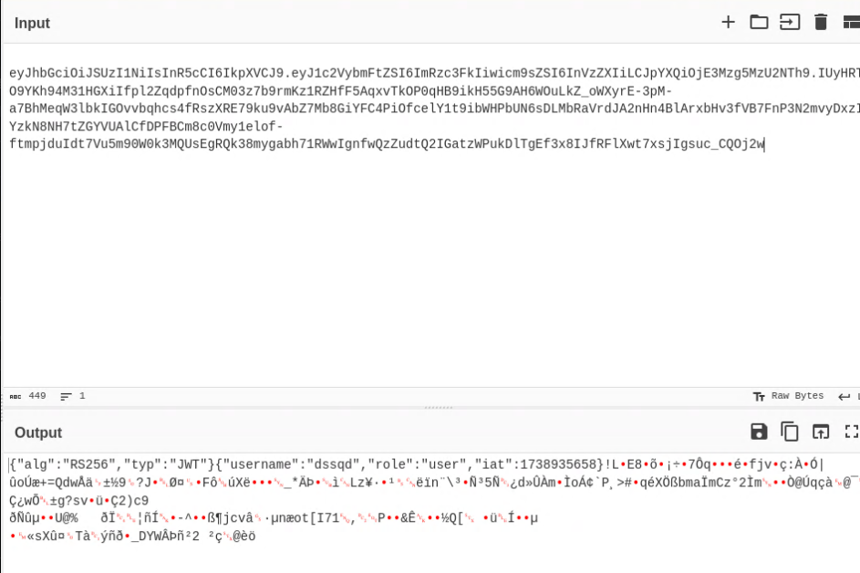

# Soluce 

When you arrive on the page, you'll see that it uses JWT tokens.

We'll decrypt the JWT token from base 64 via https://cyberchef.io/, giving the following result:

We can see that we have the user role and that we're using the RS256 asymmetric algorithm. If we explore the JS code of the page, we can see that we have access to the public key via a /public-key route.

A common JWT vulnerability is “RS256 --> HS256”. We go from an asymmetrical verification to a symmetrical verification to sign the JWT with the public key we have. Since it's symmetrical, the server will verify the signature with the same public key, so if we give ourselves the admin role, we'll be authenticated. The server must not check that it's using the right algorithm.

A JWT consists of three parts: HEADER.PAYLOAD.SIGNATURE
It's easy to recreate the HEADER with the HS256 security standard and the PAYLOAD with the admin role.

The code to do this is [here](baby_web.py).