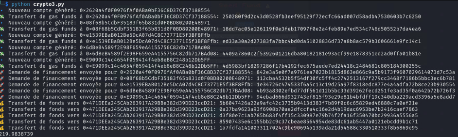

# Soluce

They give an address and a port to contact with netcat, when we contact this address, we are given our credentials to use the blockchain, example:

contract address: 0x6a21F299fb0a001565315C2c07Fb88f68D455896
rpc-url: http://blockchain.bitskrieg.in:45726/
Wallet private-key: 0xdfd2ede15220488f155f3e9a87d1f5c4355ff79d108dc37ebe82ebdf2efefea5
Wallet address: 0x471DEEa245CAb263917A29BBe382d39DD23ccD21
Secret: 8df2ef40bee09eb40c666d1e0eae7995db953a8e61b05d2ba65f5e6a4005d80e
Please save the provided secret, it will be needed to get the flag

When we read the blockchain doc, we realize that we can have a maximum of 21 units by mining, but the challenge requires us to have 100. We are given the code of the blockchain and its different functions.

We realize that we can create several accounts, mine with them, and then make a transaction to the main account that the CTF monitors.

So that's what we do via ./seed_fund.py

After that we do the netcat again, and the ctf detects that we have enough money, so we have the flag.
