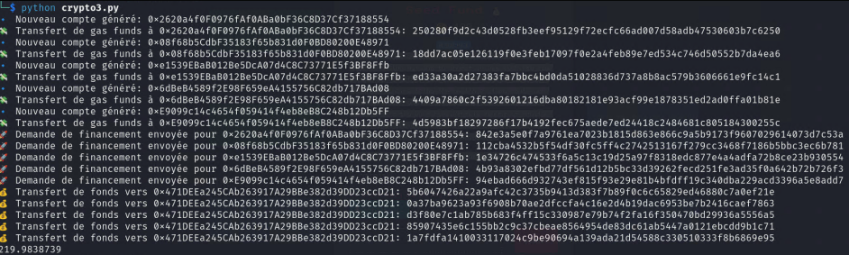

# Challenge description

BITS is known for its startup culture & we have one Angel Investor willing to invest in one such new age blockchain startup. Your startup needs at least 100 ether of funding to be the next big story! But, our Angel Investor only provides a maximum of 21 ether funding that too on a considerable amount of equity. He may even chose to buy the whole company but that ain't happening to you in my opinion ;

Can you secure your dream funding & shake the markets?

# Blockchain code

```solidity
// SPDX-License-Identifier: MIT
pragma solidity ^0.8.0;

contract AngelInvestor {
    struct Startup {
        uint256 fundingAmount;
        uint256 equityOffered;
        bool hasReceivedFunding;
        bool isBought;
    }

    mapping(address => Startup) public startups;
    address public investor;
    uint256 public totalFunds;
    bool public challengeSolved = false;

    uint256 public constant BUYOUT_RATE = 400 ether;
    uint256 public constant CHALLENGE_THRESHOLD = 100 ether;

    modifier onlyInvestor() {
        require(msg.sender == investor, "Only investor can perform this");
        _;
    }

    constructor() payable {
        investor = msg.sender;
        totalFunds = address(this).balance;
    }

    function applyForFunding(uint256 equityOffered) external {
        require(equityOffered > 0 && equityOffered <= 7, "Equity offered must be between 1% and 7%");
        require(!startups[msg.sender].hasReceivedFunding, "Already funded");

        uint256 fundingAmount = equityOffered * 3 ether;
        require(fundingAmount <= 21 ether, "Cannot exceed 21 ETH funding");
        require(totalFunds >= fundingAmount, "Not enough funds available");

        (bool success, ) = msg.sender.call{value: fundingAmount}("");
        require(success, "Funding transfer failed");

        totalFunds -= fundingAmount;
        startups[msg.sender].fundingAmount += fundingAmount;
        startups[msg.sender].equityOffered = equityOffered;
        startups[msg.sender].hasReceivedFunding = true;
    }

    function donateToInvestorPool() external payable {
        require(msg.value > 0, "Must donate some ETH");
        totalFunds += msg.value;
    }

    function buyCompany(address startupOwner) external onlyInvestor {
        require(startups[startupOwner].hasReceivedFunding, "Startup must be funded first");
        require(!startups[startupOwner].isBought, "Company already bought");
        require(totalFunds >= BUYOUT_RATE, "Not enough funds to buy");

        (bool success, ) = startupOwner.call{value: BUYOUT_RATE}("");
        require(success, "Purchase transfer failed");

        totalFunds -= BUYOUT_RATE;
        startups[startupOwner].isBought = true;
    }

    function isChallSolved() external returns (bool) {
        if (!challengeSolved && msg.sender.balance >= CHALLENGE_THRESHOLD) {
            challengeSolved = true;
        }
        return challengeSolved;
    }
}
```

# Soluce

They give an address and a port to contact with netcat, when we contact this address, we are given our credentials to use the blockchain, example:

contract address: 0x6a21F299fb0a001565315C2c07Fb88f68D455896
rpc-url: http://blockchain.bitskrieg.in:45726/
Wallet private-key: 0xdfd2ede15220488f155f3e9a87d1f5c4355ff79d108dc37ebe82ebdf2efefea5
Wallet address: 0x471DEEa245CAb263917A29BBe382d39DD23ccD21
Secret: 8df2ef40bee09eb40c666d1e0eae7995db953a8e61b05d2ba65f5e6a4005d80e
Please save the provided secret, it will be needed to get the flag

When we read the blockchain doc, we realize that we can have a maximum of 21 units by mining, but the challenge requires us to have 100. We are given the code of the blockchain and its different functions.

We realize that we can create several accounts, mine with them, and then make a transaction to the main account that the CTF monitors.

So that's what we do via [this code](code/seed_fund.py).



After that we do the netcat again, and the ctf detects that we have enough money, so we have the flag.
