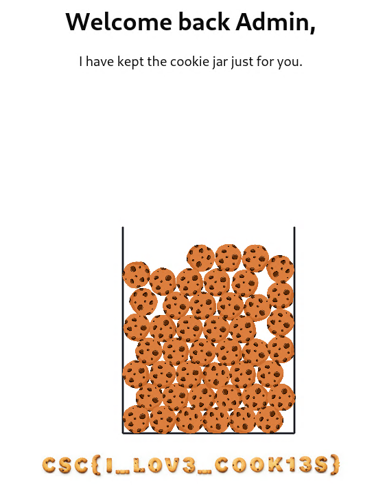

# Challenge description

"Cookies cookies cookies" - Milk

Access the server via
http://cookies.challenges.cybersecuritychallenge.be

# Soluce

Here is the code of the server:

```js
"use server"

const SECRET_KEY = "fake_key_for_testing"

function xorStrings(str1: string, str2: string): string {
  const length = Math.max(str1.length, str2.length);

  return Array.from({ length }, (_, i) =>
    String.fromCharCode(
      str1.charCodeAt(i % str1.length) ^ str2.charCodeAt(i % str2.length)
    )
  ).join('');
}

export async function generateCookie(value: string): Promise<string> {
  const timestamp = new Date().toISOString()
  const signature = xorStrings(xorStrings(xorStrings(value, SECRET_KEY), timestamp), SECRET_KEY)
  const b64Signature = btoa(signature)

  return ${value}|${timestamp}|${b64Signature}
}

export async function decodeCookie(cookie: string): Promise<{ success: boolean, value: string }> {
  try {
    const parts = cookie.split("|")

    if (parts.length !== 3) {
      throw new Error("Supplied cookie does not have 3 parts.")
    }

    const [value, timestamp, b64signature] = parts
    const signature = atob(b64signature)

    const expectedSignature = xorStrings(xorStrings(xorStrings(value, SECRET_KEY), timestamp), SECRET_KEY)

    if (signature !== expectedSignature) {
      throw new Error("Cookie signature is invalid.")
    }

    return { success: true, value: value }
  } catch (error) {
    return { success: false, value: "" }
  }
}
```

We can see that the server generates a cookie by XORing the value with a secret key. If we go on the website, we can get a default cookie `guest|2025-03-14T10:01:09.201Z|VUVXRllXRkhCQDNEVUlEVk9VSlpVRVQp`. The goal is to retrieve SECRET_KEY and generate a cookie with the value `admin`.

Let's begin by decode the signature of the default cookie:

```js
atob("VUVXRllXRkhCQDNEVUlEVk9VSlpVRVQp")
```

It returns `UEWFYWGFB@3DUIDVOUJZUET)`

We can find the SECRET_KEY with [this script](cookies_decode.js).

The script returns: 

```sh
┌──(kali㉿kali)-[~/Downloads/web 3]
└─$ node cookies_decode.js            
Decoded Signature: UEWFYWFHB@3DUIDVOUJZUET)
Step 1 XOR (Signature ⊕ guest) → Should be Timestamp: 2025-03-14T10:01:09.201Z
SECRET_KEY: 
Length of SECRET_KEY: 24
SECRET_KEY (Hex): 0 0 0 0 0 0 0 0 0 0 0 0 0 0 0 0 0 0 0 0 0 0 0 0
```

So the SECRET_KEY is `000000000000000000000000`: an empty string `""`.

Now we can generate a cookie with the value `admin` with [this script](cookies_generate.js).

The script returns:

```sh
┌──(kali㉿kali)-[~/Downloads/web 3]
└─$ node cookies_generate.js 
New Cookie: admin%7C2025-03-15T20%3A14%3A30.738Z%7CU1RfXENRV0BYWzVWXVNfVV5eWUBWV1Uz
```

We can replace the cookie on the website with the new one and refresh the page to get the flag.



So the flag is `CSC{I_LOV3_COOK13S}`.