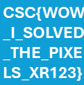

# Challenge description

You’ve been invited to participate in a top-secret challenge!
A cryptic investigation launched by a secretive organization called CyberSpaghetti Corp.
The company has recently unveiled a new AI-powered communication device.
They claim it is able to convey messages in a truly mesmerizing way.
Using these visual elements the human brain gets easily deranged.
It’s all a part of their next-generation AI communication system,
which promises Predictive Network Guards using Reinforced Guard Bots.
But I can't find any of those features!

# Soluce

When we look at the gif that is presented to us, we can see that it is a black background with white dots that sometimes flash in blue that descend successively.

We can imagine that if we add all the frames, the points will form the flag, let's try that by opening the gif in gimp. Unfortunately when we do it is all black because the alpha channel of all frames is not set on invisible.

We will use the following script to fix this:

```sh
convert dots.gif -fuzz 10% -transparent black dots_transparent.gif
```

Now we can open the gif in gimp and add all the frames to see the flag.



So the flag is `CSC{WOW_I_SOLVED_THE_PIXELS_XR123}`.