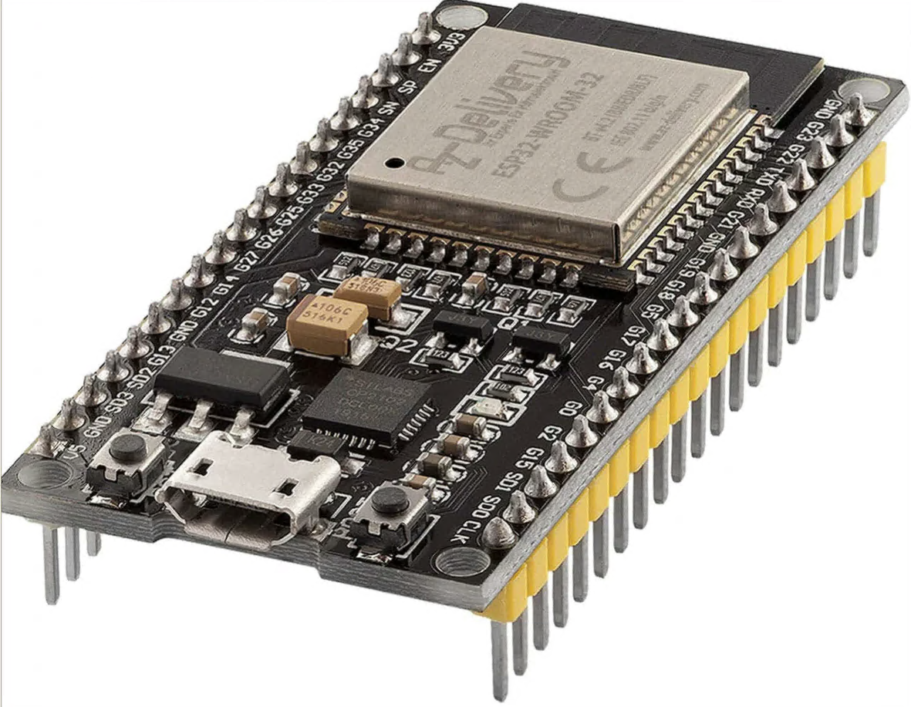

# Challenge description

We found this harmless device in our office.



We plugged it into our laptop, and the console printed a funny joke. It can't be harmful, right?

# Soluce

The description tells us about joke, so we will search about that:

```sh
┌──(kali㉿kali)-[~/Downloads]
└─$ strings dump.flash | grep -iE "joke" 

*jokes
}joke_0
I've got a really good UDP joke to tell you but I don
joke_1
+joke_2
s(joke_3
joke_4
Java and C were telling jokes. It was C's turn, so he writes something on the wall, points to it and says "Do you get the reference?" But Java didn't.
        (joke_5
joke_6
joke_7
joke_8
Hey, wanna hear a joke?
joke_9
joke_10
>joke_11
joke_12
joke_13
joke_14
joke_15
L6rjoke_16
joke_17
joke_18
.joke_19
djoke_20
gjoke_21
joke_22
joke_23
joke_24
'joke_25
joke_26
joke_27
joke_28
joke_29
joke_30
joke_31
joke_32
joke_33
gjoke_34
joke_35
joke_36
joke_37
djoke_38
joke_39
J0joke_40
$joke_41
_joke_42
joke_43
w mjoke_44
joke_45
"joke_46
joke_47
Uz$;joke_48
joke_49
joke_50
"Can I tell you a TCP joke?"
"Please tell me a TCP joke."
"OK, I'll tell you a TCP joke."
joke_51
aAjoke_52
joke_53
joke_54
joke_55
3joke_56
joke_57
vHjoke_58
wyEI WRITE MY JOKES IN CAPITALS.
joke_59
joke_60
joke_61
joke_62
[-joke_63
joke_64
joke_65
oqjoke_66
Ljoke_67
joke_68
^eT!joke_69
joke_70
joke_71
joke_72
joke_73
@joke_74
joke_75
joke_76
Because the flag was "t00_h1gh_t0_r34ch" 
joke_77
```

So the flag is `t00_h1gh_t0_r34ch`.