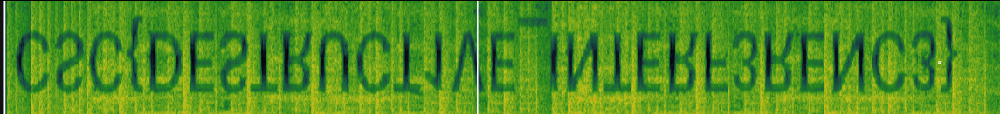

# Challenge description

How does the fancy tech in my headphones work again?

# Soluce

The challenge gives us an audio file. We will open it with:

```sh
sonic-visualiser enjoy.mp3
```

Then we will click on `layer` and `Add Spectogram` (and select the 2 channels).



So the flag is `CSC{DESTRUCT1VE_INTERF3RENC3}`.