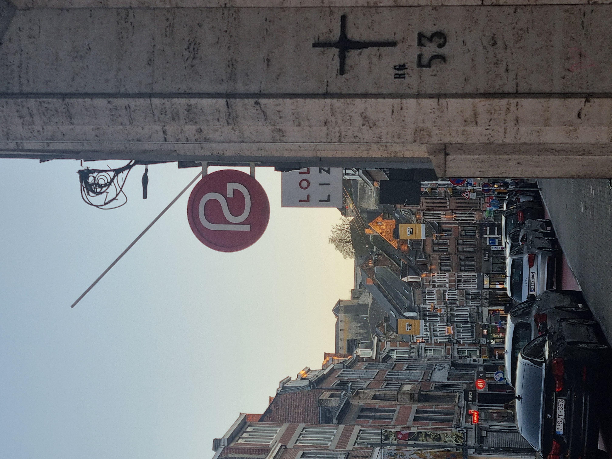
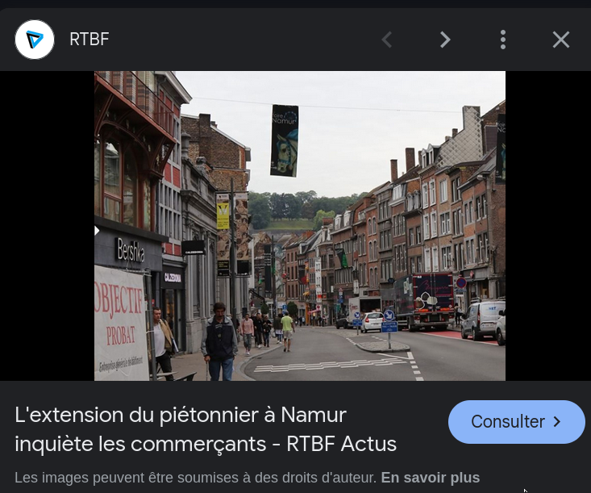
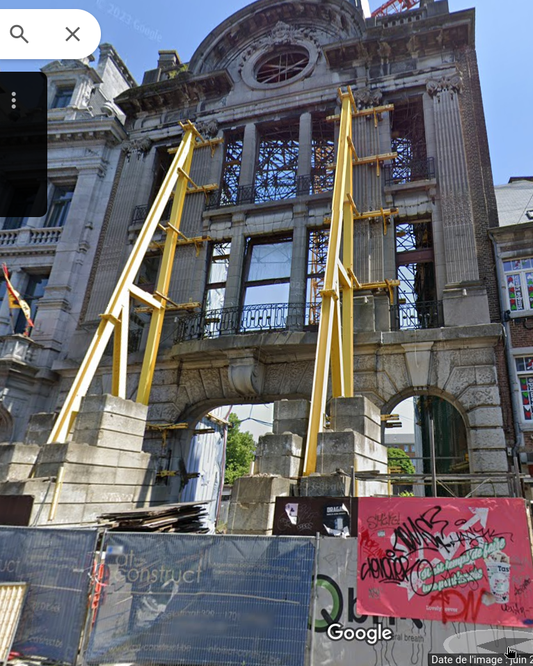
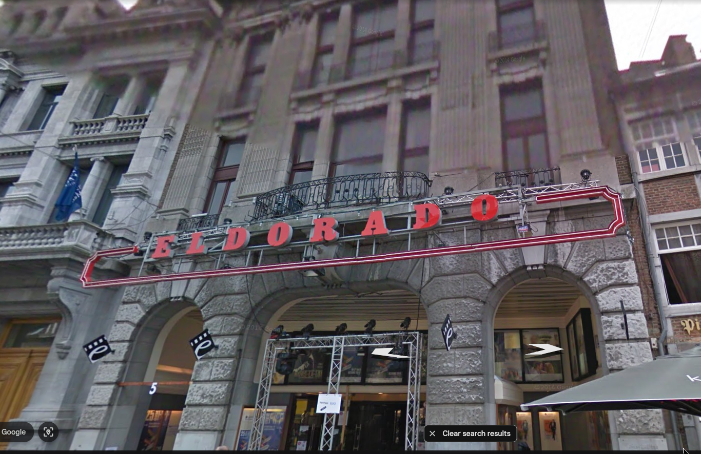

# Challenge description

I took this photo in a place I love to frequent, a place that soothes me with every visit. The funny thing is that a few years ago, I often went to another place that is just on the left of this photo, a place full of memories.

Flag format: csc{building_name}

# Soluce

When we put the image on google image, we have this:

Now we know the image is from `Namur`. We can search on Google Maps `Lola & Lisa` in Namur.

We find the right place. Now we can look on the left like the description says. We find this:

We can see an old building, probably the one in the description. Only the facade of the building remains. Let's go to Google Earth to find old images:

Luckily, we don't have to go back in the timeline; the images are old. We can see that the old building is called `Eldorado`.

So the flag is `CSC{Eldorado}`.