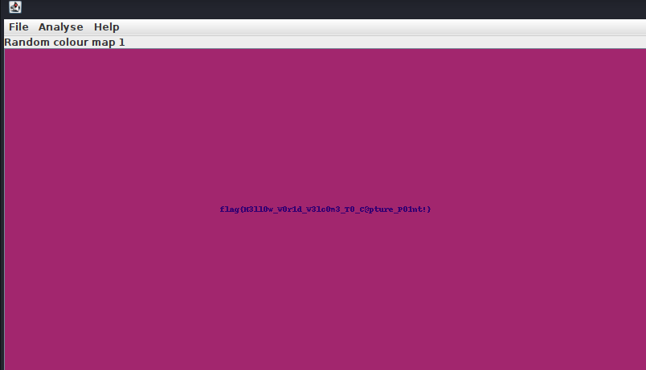

# Challenge description

Not all secrets are burried in dark !!

[Hello.png](media/Hello.png)

# Soluce

When we open the image, it's just a black image. We can use `Stegsolve` to extract the hidden message. We can use the command:

```bash
┌──(virgile㉿localhost)-[~/Téléchargements]
└─$ java -jar ./Stegsolve.jar
```

Then we can open the image and switch to filters with `-->` button. We can try the different filters. The one that works is `Random Color Map`. We can see a message:



So the flag is `flag{H3ll0w_W0r1d_W3lc0m3_T0_C@pture_P01nt!}`.