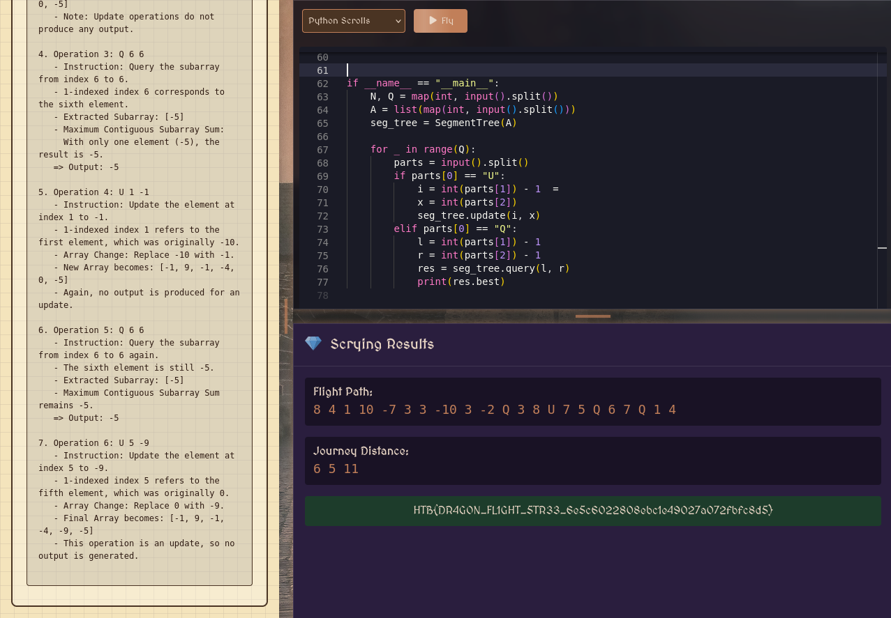

# Challenge description

In the mystical realm of the Floating Isles, dragons soar between ancient sanctuaries. However, unpredictable wind conditions can either boost or hinder their journeys.

# Soluce

Description on the website:

```md
In the mystical realm of the Floating Isles, ancient dragons traverse the skies between floating sanctuaries. However, unpredictable winds now pose a dynamic threat!

As a Dragon Flight Master, your mission is to:

    Handle both sudden wind changes and challenging flight path queries.
    Process update operations that modify the wind effect on any flight segment.
    Compute the maximum favorable continuous flight stretch (i.e., the maximum contiguous subarray sum) within a specified range.

Your precise calculations are critical to determine the safest and most efficient route for the dragons. Adapt quickly as wind conditions change, ensuring their journey remains uninterrupted.
Input Format Explanation

The input provided to the challenge is structured as follows:

    First Line: Two space-separated integers, N and Q.
        N represents the number of flight segments.
        Q represents the number of operations to perform.
    Second Line: N space-separated integers representing the initial net wind effects for each flight segment.
        A positive value indicates a tailwind, which helps the dragon travel further.
        A negative value indicates a headwind, which reduces the effective flight distance.
    Next Q Lines: Each line represents an operation that can be one of the following:
        U i x: An update operation where the wind effect on the i-th segment is changed to x.
        Q l r: A query operation requesting the maximum contiguous subarray sum (i.e., the maximum net flight distance) for the segments in the range from l to r (inclusive).

Flight Example
Flight Path Input

6 6
-10 -7 -1 -4 0 -5
Q 3 3
U 2 9
Q 6 6
U 1 -1
Q 6 6
U 5 -9
    
Expected Output

-1
-5
-5
    
Explanation

# Step-by-Step Breakdown:

1. Initial Array:
   [-10, -7, -1, -4, 0, -5]
   - This array represents the wind effects for 6 flight segments.
   - Negative numbers indicate headwinds (reducing flight distance).

2. Operation 1: Q 3 3
   - Instruction: Query the subarray from index 3 to 3.
   - 1-indexed index 3 corresponds to the third element.
   - Extracted Subarray: [-1]
   - Maximum Contiguous Subarray Sum:
     Since there is only one element, the maximum sum is simply that element, -1.
   => Output: -1

3. Operation 2: U 2 9
   - Instruction: Update the element at index 2 to 9.
   - 1-indexed index 2 refers to the second element, which was originally -7.
   - Array Change: Replace -7 with 9.
   - New Array becomes: [-10, 9, -1, -4, 0, -5]
   - Note: Update operations do not produce any output.

4. Operation 3: Q 6 6
   - Instruction: Query the subarray from index 6 to 6.
   - 1-indexed index 6 corresponds to the sixth element.
   - Extracted Subarray: [-5]
   - Maximum Contiguous Subarray Sum:
     With only one element (-5), the result is -5.
   => Output: -5

5. Operation 4: U 1 -1
   - Instruction: Update the element at index 1 to -1.
   - 1-indexed index 1 refers to the first element, which was originally -10.
   - Array Change: Replace -10 with -1.
   - New Array becomes: [-1, 9, -1, -4, 0, -5]
   - Again, no output is produced for an update.

6. Operation 5: Q 6 6
   - Instruction: Query the subarray from index 6 to 6 again.
   - The sixth element is still -5.
   - Extracted Subarray: [-5]
   - Maximum Contiguous Subarray Sum remains -5.
   => Output: -5

7. Operation 6: U 5 -9
   - Instruction: Update the element at index 5 to -9.
   - 1-indexed index 5 refers to the fifth element, which was originally 0.
   - Array Change: Replace 0 with -9.
   - Final Array becomes: [-1, 9, -1, -4, -9, -5]
   - This operation i
```

To solve this challenge effectively, we need to use a data structure capable of making ad hoc updates and sub-table queries with maximum subarray sum, like a Segment Tree with specific info.

You can't just use a simple sum: maximum subarray sum is a non-associative operation. So you need to store for each segment:

- Total sum of the range
- Maximum prefix sum
- Maximum suffix sum
- Maximum subarray sum

Here is the code to solve this challenge: [dragon_flight.py](code/dragon_flight.py)

When you run the code on the website, you will see this:



So the flag is `HTB{DR4G0N_FL1GHT_5TR33_6e5c6022808ebc1e49027a072fbfc8d5}`.