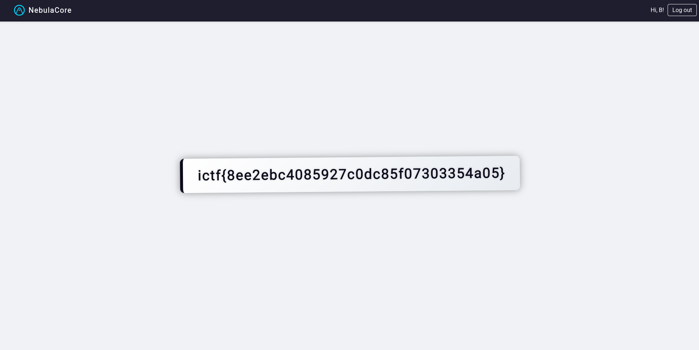

# Challenge description

Didn't have time to implement the email sending feature but that's ok, the site is 100% secure if nobody knows their password to sign in!

http://passwordless.chal.imaginaryctf.org

# Soluce 

I started by looking at the backend code of the website.

We can see that we can register:

```js
const nEmail = normalizeEmail(req.body.email)          // ← email BRUT
const initialPassword = req.body.email + randomHex32   // ← email + random string
bcrypt.hash(initialPassword, 10, ...) 
```

And login:

```js
const email = normalizeEmail(req.body.email)           // ← email BRUT
bcrypt.compareSync(password_saisi, user.password)      // bcrypt truncates to 72 bytes https://pkg.go.dev/golang.org/x/crypto/bcrypt#pkg-overview
```

So if we register with an email of 72 bytes, we know that the password will be exactly this email.

So I registered with the email:

```
bbbbbbbbbbbbbbbbbbbbbbbbbbbbbbbbbbbbbbbbbbbbbbbbbbbbbbbbbbbbbbbbbbbbbbbbbbbbbbbbbbbbbbbbbbbbbbbbbbbbbb@gmail.com
```

And I login with the same email as password.



So the flag is: 

`ictf{8ee2ebc4085927c0dc85f07303354a05}`