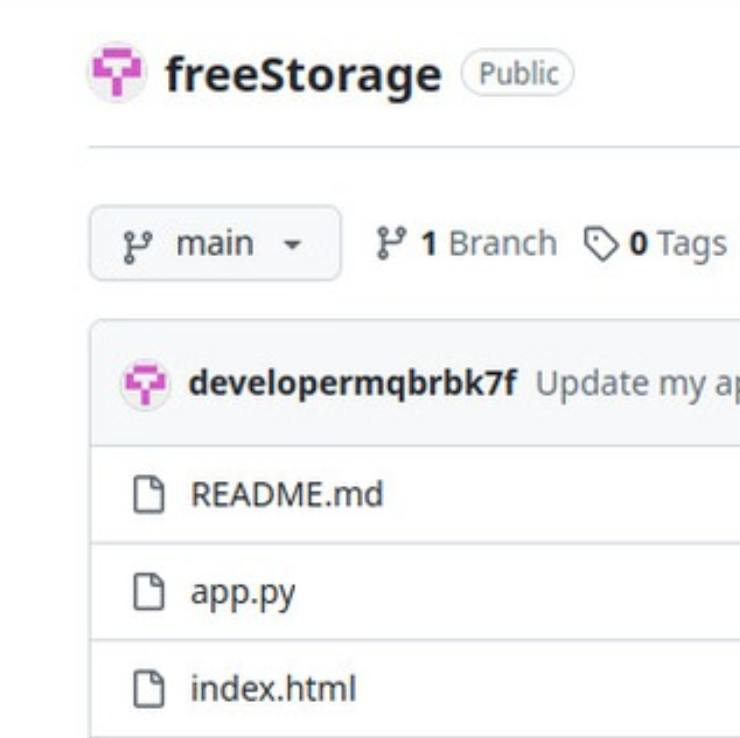
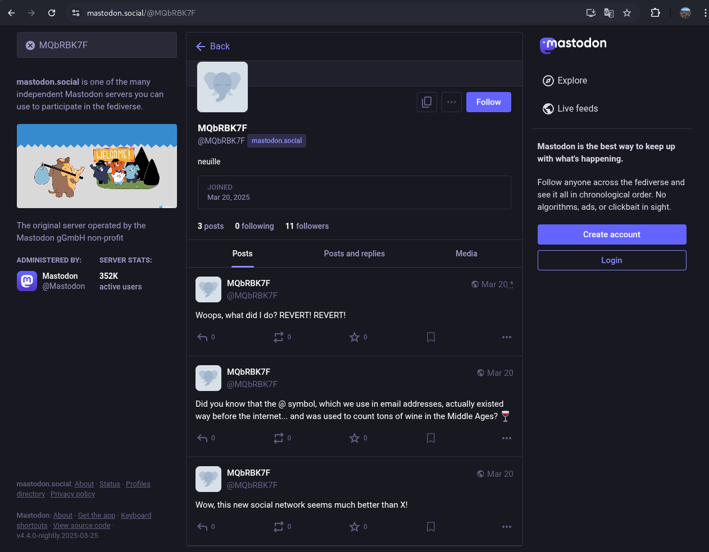

# Challenge description

This is an OSINT challenge

I've just joined a brand new social network where I love sharing anecdotes and tips.
If you'd like to add me, here's my username: mqbrbk7f

Note that a very big website forgot to renew their domain about 12h ago. You may need to manually override your hosts file to its real IP to make it work.

# Soluce

We start by looking for the username `mqbrbk7f` on social networks. We find a profile with the same name on Instagram: https://www.instagram.com/mqbrbk7f/

## Instagram - First hint

On the profile, there is one post: 



Now, we have the link of a GitHub account: https://github.com/developermqbrbk7f

On this account, there is one repository, let's see the last commit changes: https://github.com/developermqbrbk7f/freeStorage/commit/bbf5c2aa319285905750be12b8b77200c4c204fa

We can see at the end of `passwords.json` an erase password:

```json
{
    "title": "Store my secrets online for free",
    "password": "th3_w4yback_k1ng"
}
```

This is probably a password to access something, but also a hint: `th3_w4yback_k1ng` is a reference to the Wayback Machine, a digital archive of the web.

## Instagram - Second hint

On the profile, there is a description: MQbRBK7F

With this precise string, we find somebody on mastodon: https://mastodon.social/@MQbRBK7F



There is a post: `Woops, what did I do? REVERT! REVERT!`. So we have to revert the profile to a previous version. Let's check the Wayback Machine: https://web.archive.org/web/*/https://mastodon.social/@MQbRBK7F


It gives us a pastbin link: https://pastebin.com/MQbRBK7F

We need a password to access it, but we already have one: `th3_w4yback_k1ng`. Let's try it.

It works, so the flag is `csc{pr1v4cy_15_4n_1llu510n}`.